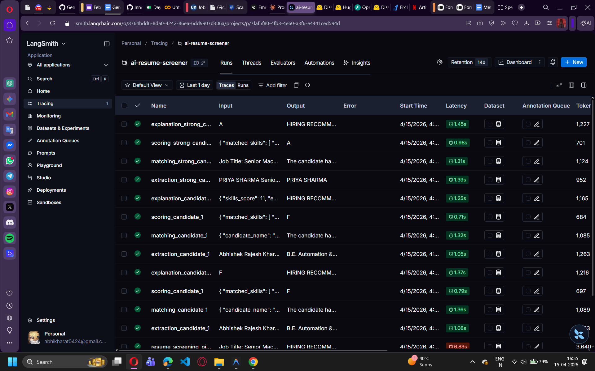
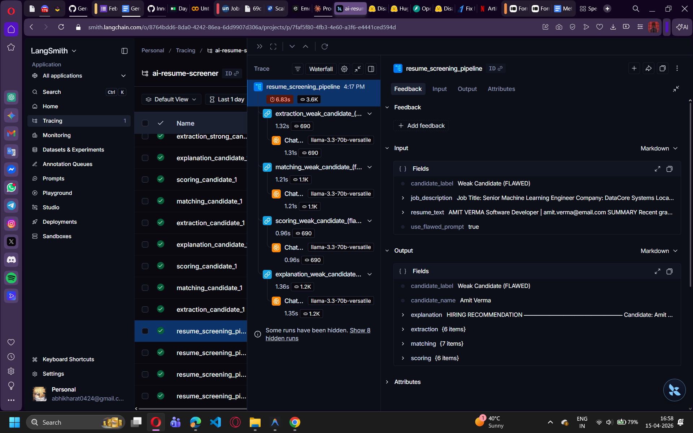
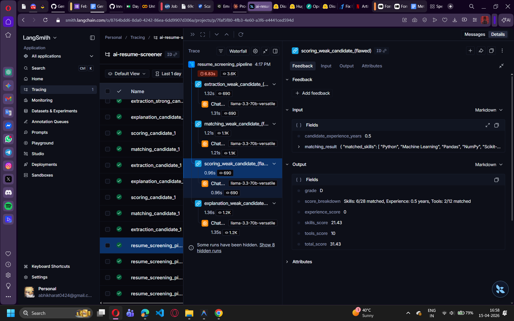

# AI Resume Screening System - Project Report
**Internship Assignment: GenAI Pipeline with LangChain & LangSmith Tracing**

## 1. Objective and Problem Statement
The objective of this project is to build an AI-powered Resume Screening System that evaluates multiple candidates based on a given Job Description. By transitioning from basic prompt usage to building a production-level pipeline, this project helps automate recruiter workflows.

The system takes a Candidate Resume and a Job Description as input and processes them through a sequential pipeline using **LangChain** and **Groq (Llama 3.3-70B model)**. Finally, the system outputs an overall **Fit Score** and an **Explanation** for why that score was given, making the AI's decision transparent and reliable.

---

## 2. Pipeline Design & Architecture
The system was designed using a modular **LangChain Expression Language (LCEL)** approach. The pipeline is separated into individual prompt templates and chains:

1. **Step 1: Skill Extraction** (`chains/extraction_chain.py`)
   - Reads the resume text.
   - Using `extraction_prompt.py`, it forces the LLM to strictly output structured JSON containing the candidate's skills, total years of experience, tools they know, and candidate name.
   - *Constraint:* The prompt specifically prohibits hallucinating skills that are not explicitly present in the resume.

2. **Step 2: Matching Logic** (`chains/matching_chain.py`)
   - Receives the previously extracted candidate JSON profile and matches it against the provided Job Description (`data/job_description.txt`).
   - Determines matched skills, missing skills, matched tools, and missing tools.

3. **Step 3: Scoring** (`chains/scoring_chain.py`)
   - Assigns a weighted score (0–100) based on:
     - **Skills Match:** 50%
     - **Experience:** 30%
     - **Tools Match:** 20%
   - Outputs a numeric score and a corresponding Grade (A to F).

4. **Step 4: Explanation** (`chains/explanation_chain.py`)
   - Consolidates all previous outputs.
   - Generates a final human-readable hiring recommendation. It justifies the assigned score and lists the candidate's strengths and weaknesses.

---

## 3. LangSmith Tracing & Debugging Proof
All runs in this system are wrapped with the `@traceable` decorator and tracked via LangSmith. The environment is configured with `LANGCHAIN_TRACING_V2=true`.

*Please see the included screenshots that display:*
1. The successful extraction, matching, and scoring runs for the **Strong**, **Average**, and **Weak** candidates.
2. The full pipeline metadata, input/output traces, and latency timings.

### Debugging & The "Flawed Prompt" Case
To demonstrate debugging, there is an explicit **Flawed Prompt Demo** built into the application. 
- When enabled, the system uses a flawed prompt that subtly encourages the LLM to hallucinate extra skills. 
- LangSmith clearly registers and traces this hallucination anomaly. By comparing the trace of the standard Weak candidate run against the Flawed Weak candidate run, it is easy to monitor and catch LLM hallucinations.

**[Please save your two screenshots in this folder as `overview_screenshot.png` and `trace_tree_screenshot.png`]**

---

## 4. Technical Stack
- **Language:** Python
- **Framework:** LangChain (LCEL & Prompts)
- **Tracing:** LangSmith
- **LLM API:** Groq (Llama 3.3-70B)
- **UI:** Streamlit

## 5. Conclusion
Using modular prompts and chaining significantly reduced hallucinations. By separating the extraction from the scoring, the LLM processes data more analytically. LangSmith proved crucial in validating the outputs at each step, guaranteeing that the AI's final Fit Score is directly linked to the candidate's actual qualifications.
